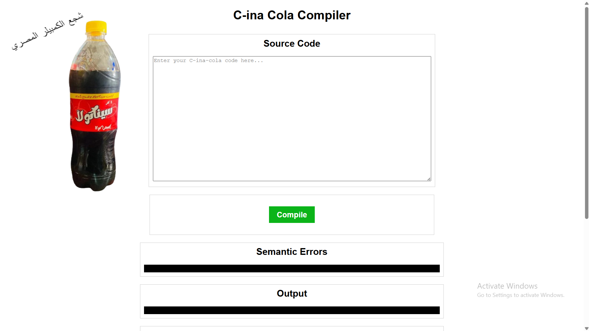

# 🌟 **{C-ina-Cola} Simple Programming Language Compiler**
## شجع الكومبيلر المصري

Welcome to the **C-ina-Cola** project! This compiler is designed using the Lex and Yacc compiler-generating packages, developed as part of the CMP(N)403 Languages and Compilers course at Cairo University, Spring 2024.

Our project showcases the design and implementation of a custom programming language, complete with lexical analysis, syntax parsing, and semantic checks. The project is divided into phases, each enhancing the functionality and robustness of the compiler.

---

## 🛠️ **Key Features**

### 1. **Language Constructs**

Our language supports a wide range of constructs, including:

- **Variables and Constants Declaration**: Define variables and constants with ease.
- **Mathematical and Logical Expressions**: Perform complex calculations and logical operations.
- **Control Structures**: Use `if-then-else`, `while`, `repeat-until`, `for`, and `switch` statements to control the flow of your programs.
- **Block Structure**: Enjoy nested scopes with variables that can be declared at the beginning of blocks.
- **Functions**: Define and call functions to encapsulate reusable logic.
- **Type_Conversion**: Convert between (int - float - string - bool) variables.
- **Semantics Error**: Define and detect some basic Sematic Errors like: {UNDECLARED VARIABLE - REDECLARE VARIABLE - OUT_OF_SCOPE VARIABLE - UNINITIALIZED VARIABLE - CONSTANT VARIABLE - UNUSED VARIABLE - TYPE_MISMATCH - CONSTANT_IF}.

### 2. **Lexical Analysis**

- **Custom Lexer**: Built using Lex, our lexer efficiently tokenizes the source code, identifying keywords, operators, identifiers, literals, and more.

### 3. **Syntax Parsing**

- **YACC Parser**: The parser, built with Yacc, implements action rules that generate quadruples and ensure the syntax is correct.
- **Error Handling**: Robust syntax error handler that detects and reports issues in the code.

### 4. **Semantic Analysis**

- **Type Checking**: Ensure variables are used correctly according to their types.
- **Declaration Conflicts**: Detect multiple declarations of the same variable.
- **Variable Initialization**: Warn about variables used before initialization.
- **Unused Variables**: Identify and report variables that are declared but never used.
- **Type Conversion (Optional)**: Automatically convert types to match operators' semantic requirements.

### 5. **Symbol Table**

- **Extensible Format**: Our symbol table is designed to be flexible and extensible, accommodating future language enhancements with ease.

---

## 🗂️ **Project Structure**

### **Lex File (`main.l`)**

This file contains the lexical rules for our language, defining how to recognize tokens like keywords, operators, identifiers, and literals.

### **YACC File (`main.y`)**

This file contains the grammar rules for our language, handling the syntax parsing and generating corresponding quadruples.

### **GUI Files**

**_(`Frontend: React.js`)_**

React Components: The frontend interface is developed using React.js, a popular JavaScript library for building user interfaces. The interface allows users to input source code, compile it, and view the results directly within the browser..

**_(`Backend: Python with Flask/Django`)_**

`app.py`: This Python file serves as the backend for the GUI, handling requests from the frontend and processing them with the Lex and Yacc-based compiler.
REST API: The backend exposes RESTful endpoints that the frontend can call to send the source code and receive the compiled output.
Integration: The Python backend runs the Lex and Yacc processes, captures their output, and returns it to the frontend for display...

---

## 🎮 **Usage & Evaluation**

Feed your source code file into our compiler, and it will:

- **Produce Quadruples**: See the intermediate representation of your code.
- **Display Syntax Errors**: Identify and correct mistakes in your program's structure.
- **Display Semantic Errors**: Ensure your program makes logical sense and follows the rules of the language.
- **Show the Symbol Table**: View the detailed information about variables and functions used in your code.

### **Evaluation Criteria**

- **Correctness**: The accuracy of the generated quadruples.
- **Error Handling**: How well syntax and semantic errors are detected and reported.
- **Documentation & Teamwork**: Comprehensive documentation and effective collaboration.

---

## 🌍 **Development Environment**

This project is developed using:

- **Lex**: A tool for generating lexical analyzers.
- **Yacc**: A tool for generating parsers.
- **C/C++**: For integrating the lexer and parser and handling I/O operations.

---

## 🚀 **How to Runthe GUI**

1. **Clone the Repository**:
   ```bash
   git clone <your-repo-link>
   ```
2. **Navigate to the Project Directory**:
   ```bash
   cd C-ina-Cola
   ```
3. **Navigate to the GUI (Backend) Directory**:
   ```bash
   cd gui
   cd Backend
   ```
4. **Backend (Python) Setup**:

   - Ensure you have Python installed.
   - Install the required dependencies (Flask/Django, etc.) by running:
     ```bash
     pip install -r requirements.txt
     ```
   - Start the backend server by running:
     ```bash
     python app.py
     ```

5. **Navigate to the GUI (frontend) Directory**:
   ```bash
   cd ..
   cd frontend
   ```
6. **Frontend (React.js) Setup**:
   - Ensure you have Node.js installed.
   - Navigate to the React.js project directory and install the dependencies:
     ```bash
     npm install
     ```
   - Start the React development server:
     ```bash
     npm start
     ```
   - The React app will open in your browser at `http://localhost:3000`.

---

## 📸 **Screenshots**


_Main Interface_


_Main Features and Example of a detected semantic error_


_Symbol Table and Compilation Debug Information_

---

## 🏆 **Contributors**

- **[Your Name]** - Lead Developer and Documentation and Testing
- **Kareem Ashraf** - Lex Expert and Quadruples Specialist
- **Omar Khaled** - Yacc Expert and Semantic Analysis Specialist

---

### Ready to dive into the world of compilers? Start exploring now! 🚀

---
